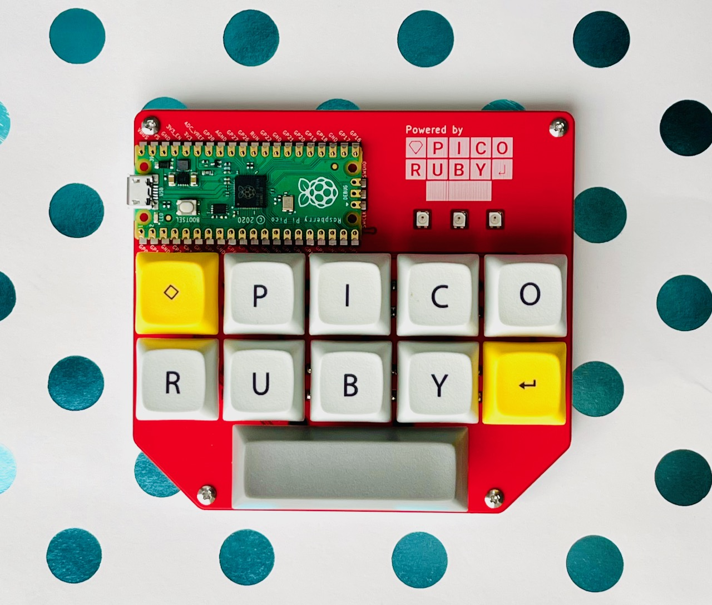

# PicoRuby Macropad

#  BOM

|Name | Part number|Quantity|
|------|-----|-----|
| MCU | Raspberry Pi Pico | 1|
| Pin header | 20pin | 2|
| PCB | PicoRubyMacroPad_PCB | 1|
| Bottom plate | PicoRubyMacroPad_Plate | 1|
| MX-compaible key switch | 5pins | 11|
| Diode | 1N4148 TH or SMD  | 11|
| Stand-off | M2 L5.5mm or longer | 4|
| Screw | M2 L4mm | 8|
| Keycap | 1U | 10|
| Keycap | 2.75U | 1|
| PCB Stabilizer | 2U | 1|
| LED | SK6812MINI-E | 3|
| Adhesive rubber feet | Dia.9mm or smaller | 4|
